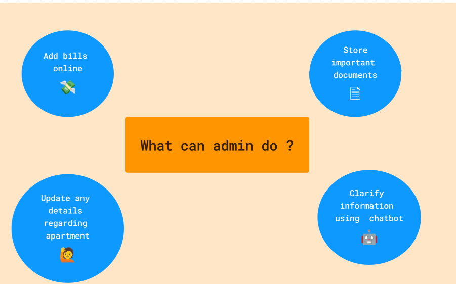

# Apartment Website

This is a apartment website created in order to digitalise and manage the important activities in an apartment.

| House | Numbers | in  | the | Apartment |
| ----- | ------- | --- | --- | --------- |
| 🏠   | 001 | 002 | 003       | 004 |
| 🏡   | 101 | 102 | 103       | 104 |
| 🛖   | 105 | 201 | 202       | 203 |
| ⛺   | 204 | 205 | 301       | 302 |
| 🌇   | 303 | 304 | admin     |     |     





## Tech Stack


## Deployment

Click on the link given below to view the apartment app.

https://humanoid2005.github.io/Nike-Clone/

## Run Locally

Clone the project

```bash
  git clone https://github.com/Humanoid2005/Basic-Blog-Website.git
```

Go to the project directory

```bash
  cd project-folder
```

Install dependencies

```bash
  npm install
```

Start the server

```bash
  npm run dev
```

To open the website, type the link given below

```bash
  http://localhost:5173/
```
